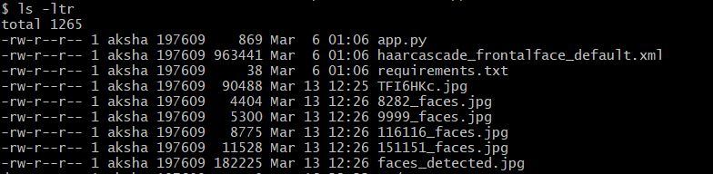
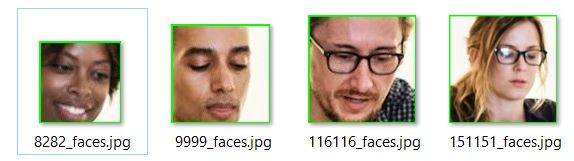

# How To Detect and Extract Faces from an Image using OpenCV and Python 

## Introduction
<!-- TODO: The introduction has a lot of interesting information, and I think that you could make it shine by reorganizing ideas and cutting out some of the duplicate information. Can you shorten the introduction while also answering the following questions?

        * What is the tutorial about?
        * Why should the reader learn this topic?
        * What will the reader do or create in this tutorial?
        * What will the reader have accomplished when they’re done?

AS : Have re casted the introduction to be in more in sync with above bullet points. Please review

 -->

This is an Image Processing tutorial about implementation of object detection and extraction from an input image using Python and OpenCV. 

Images, in today's world makes up for a big chunk of data that gets generated everyday. Trivia, did you know that we generate about 2.5 Quintillion bytes of data everyday. That's an whooping 1.78 Million GB every min !!! With that kind of image data available, there is an big need to get more and more people started in the feild of image proccessing. Anyone possesing the skills for image proccessing and machine learning automatically has an edge in tech world. Object detection and extraction in images becomes especially helpful in industries where automated cataloging is needed. Once quick example that comes to mind is automatically cataloging of library books from a picture of a book self.

In this tutorial, you will write code that will detect presence of human faces in an input image. Further it would then isolate the frames of the faces detected and crop the image to only extract the detected faces.

Before we move any further, it might be worth wile to spend a few minutes going over a brief introduction of OpenCV and HaaR classifiers. OpenCV or Open Source Computer Vision Library is an open source computer vision and machine learning library. Although most popular with python, it interfaces quite well with C++, Java and MATLAB. OpenCV is natively written in C++ and is widely used with computer vision related applications running on variety of systems like Windows, Linux, Android, MacOS etc.

HaaR Cascade is an object detection algorithm used to locate an object of interest in images. Without getting into the technical details of its inner workings, Its an computer vision machine learning algorithm where a system is provided with a large number of positive and negative samples. Positive samples being the images with object of interest in them and negative samples with images having everything but the object. Finally methods exposed by openCV are used to train a model based on these positive and negative images. After the training the trained model( usually a xml file) can be then used to automatically locate the object in any new images.   

For the sake of keeping the tutorial simple, we are going to use a publicly available OpenCV trained model for faces. OpenCV has graciously made available these trained cascade files for some of the most common objects used in image processing such as face, full body, eyes, etc. They can be found at openCV's [github repository](https://github.com/opencv/opencv/tree/master/data/haarcascades). We are going to use one such model for faces.

Although we do this for faces but we should be able to extend our program for any random object in an input image. The only prerequisite here being that you have a OpenCV object detection model or an _HaaR Cascade_ trained for that object. In which case, we can easily train our own classifier for that custom object and then use it.

By the time you are done with the tutorial, my hope is that we had achieved two things, 

a) Learned the basics of OpenCV and image processing.
b) Have a working demo of object detection in images using Python.

## Prerequisites


* A [local Python 3 development environment](https://www.digitalocean.com/community/tutorial_series/how-to-install-and-set-up-a-local-programming-environment-for-python-3), including [pip](https://pypi.org/project/pip/), a tool for installing Python packages, and [venv](https://docs.python.org/3/library/venv.html), for creating virtual environments.

<!-- TODO: Including Windows 10 as a prerequisite my limit the amount of readers your tutorial will attract. I think you should update this prerequisite to link to our tutorial series that walks readers through setting up a Python environment on different operating systems: https://www.digitalocean.com/community/tutorial_series/how-to-install-and-set-up-a-local-programming-environment-for-python-3  
AS : Done
-->

<!-- * An python development IDE such as [Atom](https://atom.io/), [Pycharm](https://www.jetbrains.com/pycharm/download/) or Vim. -->
<!-- TODO: You can remove this as a prerequisite, as readers can use the default editor on their system. 
AS : Done
-->

<!-- * Familiarity with basic concepts of image processing in general and openCV in particular. -->
<!-- TODO: I think that you can remove this as a prerequisite, as you are writing for readers of all levels.
 AS : Done
-->

* HaaR Cascade File for the object that you want to extract. Pre-trained cascades for common objects such as face, hand, eyes etc are available publicly on OpenCV's [Github Repository](https://github.com/opencv/opencv/tree/master/data/haarcascades). Please download the suitable xml file from there. In this example we are going to use `haarcascade_frontalface_default.xml`.
<!-- TODO: Please be sure to capitalize software names according to their official documentation. For example, "GitHub" and "OpenCV". Per our style guidelines, the tone of the article should be formal yet friendly. To achieve this tone, you will want to make sure that any informal words, such as "gonna", are updated to use the formal tone, such as "going to". 
AS : Done
-->

## Step 1 — Configuring the Local Environment

In this step, you will create a script that will take an image as input, process it to detect faces, and then draw a box around each face. Before you get started, you will create a workspace to hold the code and install a few dependencies.

<!-- TODO: I'm happy to see that you are enthusiastic to guide the reader, but word choices like "Lets get stated!!" don't align well with our style guidelines. Can you recast this sentence to align more closely with our style guidelines? Here's a rough example of how you can do that:

"In this step, you will create a script that will take an image as input, process it to detect faces, and then draw a box around each face. Before you get started, you will create a workspace to hold the code and install a few dependencies."

AS : Done

-->

<!-- TODO: The reader follows quite a few steps to set up their local environment, and these steps aren't directly related to writing the script. Can you make the local environment configuration its own step? Once that's done, you can make writing and running the code its own step. This will help separate tasks more clearly. Here's an example:

Step 1 — Configuring the Local Environment
Step 2 — Writing and Running the Face Detector Script
Step 3 — Extracting Faces and Saving them Locally
Conclusion and Further reading

AS : Done
-->
Create the directory by executing a `mkdir` in your workspace:

```command
mkdir face_scrapper
```

Change into the newly created directory:

```command
cd face_scrapper
```

We are going to be using virtual environment for this tutorial. Virtual Environment is a tool used to isolate different python development Environments. This becomes especially helpful when you use different version of the same dependencies across different projects. First let's install `virtualenv`
<!-- TODO: Can you briefly tell the reader why they are using a virtual environment? 
AS : Done
-->
```command
pip install virtualenv
```
Next we instantiate a virtual environment in `face_scrapper` folder using following command  
```command
virtualenv face_scrapper
```
Finally, we activate the isolated environment.
```command
source face_scrapper/Scripts/activate
```
<!-- TODO: These two commands need to be broken up and should be preceded by their own explanations. 
AS : Done
-->

<!-- Next, you will create a `requirements.txt` file and install the dependencies needed by the project. Create a `requirements.txt` file in your present directory using `touch`: -->
<!-- TODO: Can you remove this step and just have the reader create and open the file with Nano? If there's a specific reason why you are having the reader use `touch` and then opening the file, please explain why. 
AS : There's no specific reason. I think you are right.. Let me take this step out and combine this and next step together. 
-->
<!--
```command
touch requirements.txt
```
-->
Create a new file `requirements.txt` in your current directory using `vim` or `nano` and add following contents to it :
<!-- TODO: Can you please tell the reader how to open the file? As a reminder, you will need to provide the reader with every step needed to complete the tutorial. 
AS : Done
-->
```requirements.txt
[label requirements.txt]
npmpy
opencv-utils
opencv-python
```
<!-- TODO: Can you please tell the reader why they need to install these specific dependencies? It may help to tell the reader the purpose of each package. 
AS : Done
-->
Next we shall install the dependencies but before that lets look at each one the dependencies and understand what they do 

* npmpy : NumPy is a library for the Python programming language, adding support for large, multi-dimensional arrays and matrices, along with a large collection of high-level mathematical functions to operate on these arrays. [Wikipedia](https://en.wikipedia.org/wiki/NumPy)
* opencv-utils : This is the extended library for OpenCV which exposes a lot of helper functions for OpenCV.
* opencv-python : This is the core OpenCV module used by Python.

Now, lets install dependencies using Python package manager, `pip` and passing it our dependencies file (`requirements.txt`) . Note that we use a `-r` flag to specify the location of `requirements.txt` file.
```command
pip install -r requirements.txt
```
<!-- TODO: Can you tell the reader what the `-r` flag does and why they need to use it?
AS : Done
-->
Finally, download the [HaaR Cascade file](https://github.com/opencv/opencv/blob/master/data/haarcascades/haarcascade_frontalface_default.xml) for face detection from the OpenCV GitHub repository in your present directory. You will use this file shortly in your code.

```command
wget https://github.com/opencv/opencv/blob/master/data/haarcascades/haarcascade_frontalface_default.xml
```
<!-- TODO: Step 2 would then start here. Additionally, I'd like you to remove the use of H4 headers. I think that you can make this information flow really well together with some transitional sentences. We generally avoid using H4s, as they break up information and interrupt the natural flow of the tutorial. 
AS : Done
-->

## Step 2 — Writing and Running the Face Detector Script

In this section you shall look at the actual code that would take an input image and return two things:

* Number of faces found in the input image
* An output image with an rectangle plot around each of the face's found in the input image.

We shall start by first importing libraries required by our program. Open a new file `app.py` in your current directory and add following two lines to it.
<!-- TODO: The second sentence sets a tone that the tutorial isn't confident in the steps working probably. Each step should give a confident tone, so I'd like to see you remove that sentence since it takes away from your tutorial. 
AS : Done
-->
<!-- TODO: Can you tell the reader if they need to open a new file for this code? Be sure to include the file name. 
AS : Done
-->
We are importing two modules here, `cv2` and `sys`. The `cv2` module is used to import `OpenCV` library into the program and `sys` is used to import common python functions such as `argv` etc. 
```python
import cv2
import sys
```
<!-- TODO: The `command` formatting should only be used for commands ran from the CLI. If this content should be added to a file, please be sure to use the label formatting outlined at do.co/style. Please also be sure to add an explanation of why the reader will need to import these modules. 
AS : Done
-->

Next we shall read the input image and convert it to a gray-scale. We do this using OpenCV's built in read(`imread`) and convert(`cvtColor`) functions. Please note that we shall be using gray scale version of the image here for processing as single channel( here would yield better results. This [stackoverflow thread](https://stackoverflow.com/questions/12752168/why-we-should-use-gray-scale-for-image-processing) gives an good insight into reasons behind it 
<!-- TODO: Can you tell the reader why the image needs to be converted to gray-scale? Does it make objects within the image easier to detect? 
AS : Done
-->
```python
...
image = cv2.imread(imagePath)
gray = cv2.cvtColor(image, cv2.COLOR_BGR2GRAY)
...
```
<!-- TODO: Please be sure to remove any comments from the code. If you feel that a comment is needed, that might be a sign that you should add more context into your explanations for the code. 
AS : Done
-->
The `cv2.imread` function takes the input image (passed as an argument to the script) and converts it to an openCV object. Next we use OpenCV's `cvtColor` function to convert the input color image object to an gray scale object.
    
Now that you've added the code to load an image, you will add the code that detects faces in the specified image:
<!-- TODO: I added this sentence here to give the reader a short explanation of what this code does, and moved your more in depth explanations below the code. Does that look OK to you? 
AS : Absolutely..
-->

```python 
...
# detect faces in the image
faceCascade = cv2.CascadeClassifier(cascPath)
faces = faceCascade.detectMultiScale(
        gray,
        scaleFactor=1.3,
        minNeighbors=3,
        minSize=(30, 30)
) 

print("Found {0} Faces !".format(len(faces)))
...
```

This code will first create a `cascadeClassifier` model. This will load the HaaR cascade file into Python so that it may be used by your code. Next, the code applies OpenCV's `detectMultiScale` method on the face cascade. This generates a list of rectangles for all of the detected faces in the image. Here is a summary of the parameters used:

Let's take a min here to go through the parameters passed to `detectMultiScale` method in above example. 

* gray - This is the OpenCV's gray scale image object that we loaded earlier. 
* scaleFactor - Parameter specifying how much the image size is reduced at each image scale. What this means is if there are larger objects(Larger than ones that model was originally trained on) appearing in the image, they can be scaled down for better detection.
<!-- TODO: Can you add some additional clarification here? Does this mean that the image is scaled when the script is ran? 
AS : Done
-->
* minNeighbors - Parameter specifying how many neighbors(detections) each candidate rectangle should have to retain it. I have found tuning this parameter to be the most helpful in getting better detections. In other words, this parameter will affect the quality of the detected faces. Higher value results in less detections but with higher quality. 
* minNeighbors - Parameter specifying how many neighbors(detections) each candidate rectangle should have to retain it. I have found tuning this parameter to be the most helpful in getting better detections. In other words, this parameter will affect the quality of the detected faces. Higher value results in less detections but with higher quality. 
<!-- TODO: Can you clarify for the reader what is meant by "neighbors"? Is this referring to neighboring faces in the image? 
AS : Done
-->
* minSize - Minimum possible object size. Objects smaller than that are ignored. This parameter determine how small size you want to detect. You decide it! Usually, [30, 30] is a good start for face detection 
<!-- TODO: Can you recast to tell the reader what unit this is measured in? 
AS : Done
-->

<!-- TODO: You have some great explanations here. I think that we could really make this shine through with some recasting and reorganization. What do you think about something like my example below? Please be sure to update the bullet points with updated explanations of the parameters.

AS : Done. I took your recast and used it to replace the original content. Thanks.

"This code will first create a `cascadeClassifier` model. This will load the HaaR cascade file into Python so that it may be used by your code. Next, the code applies OpenCV's `detectMultiScale` method on the face cascade. This generates a list of rectangles for all of the detected faces in the image. Here is a summary of the parameters used:

* gray - This is the openCV's gray scale image object that we loaded earlier. 
* scaleFactor - This parameter specifies how much the image size is reduced at each image scale.
* minNeighbors - This parameter specifies how many neighbors each candidate rectangle should have to retain it. Tuning this parameter can help improve the object detection capabilities of your code.
* minSize - This specifies the minimum possible object size. Objects smaller than this size are ignored.

The last line of this code snippet will count the number of faces found using `len`, and print output to tell you how many faces were found." -->
    
The last line of this code snippet will count the number of faces found using `len`, and print output to tell you how many faces were found.


```python    
...
for (x, y, w, h) in faces:
    cv2.rectangle(image, (x, y), (x+w, y+h), (0, 255, 0), 2)
...
```

In the above code, we use a `for` loop to draw an rectangle around detected faces in the image using OpenCV's `rectangle` method.

```python
...
status = cv2.imwrite('faces_detected.jpg', image)
...
```
<!-- TODO: Can you break this code down further for the reader? Try explaining what each line's function is. 
AS : Done
-->
Next we write the new image(with rectangles) to local file system using OpenCV's `imwrite` method and capture the return status. This method returns a `true` if the write was successful and an `false` if it wasn't.
```python
...
print ("Image faces_detected.jpg written to file-system : ",status)
...
```
Finally we print the return status of the previous function, `imwrite` to console and exit.
<!-- TODO: Can you also remove this header? 
AS : Done
-->

The completed file will look like this
<!-- TODO: Since you've already explained the code, you can recast this to say "The completed file will look like this:"
AS : Done
-->

```python
[label app.py]
import cv2
import sys

imagePath = sys.argv[1]
cascPath = "haarcascade_frontalface_default.xml"

image = cv2.imread(imagePath)
gray = cv2.cvtColor(image, cv2.COLOR_BGR2GRAY)

faceCascade = cv2.CascadeClassifier(cascPath)
faces = faceCascade.detectMultiScale(
    gray,
    scaleFactor=1.3,
    minNeighbors=3,
    minSize=(30, 30)
)

print("[INFO] Found {0} Faces !".format(len(faces)))

for (x, y, w, h) in faces:
    cv2.rectangle(image, (x, y), (x + w, y + h), (0, 255, 0), 2)

status = cv2.imwrite('faces_detected.jpg', image)
print("[INFO] Image faces_detected.jpg written to file-system : ", status)
```

<!-- TODO: Can you please add a step to tell the reader to save and close the file? This is what I typically use:
"Once you've verified that everything is entered correctly, save and close the file. 
AS : Done.
-->
Once you've verified that everything is entered correctly, save the file as `app.py` and close it.

**The above code was sourced from OpenCV Documentation publicly available [here](https://docs.opencv.org/3.4/db/d28/tutorial_cascade_classifier.html)**

<!-- TODO: Can you remove this header and add a transitional sentence? You can use something like this:
"Your code is now completed, so you are ready to run the script." 
AS : Done
-->

Your code is now completed, so you are ready to run the script.

For this step we will have to find an image which you want to test your script with and save it in the same directory as your app.py. This tutorial would use an popular image of Beatles for this tutorial. THe same image can be downloaded from here is the reader would like to use the same example to try with this tutorial. 
<!-- TODO: Can you recast this to remove the first person language? Instead of saying "I", you can use language like "This tutorial will use...". You should also provide the image that you use in case the reader would like to use the same example. 
AS : Done
-->
Notice that the input image would need to be passed as an argument to the script. Next, invoke the script as follows:
```command
python app.py <^>path/to/input_image<^>
```
<!-- TODO: Please be sure to use command formatting here. You will also want to use <^>variable formatting<^> to make it clear to the reader that the path will need to be changed. 
AS : Done
-->

<!-- <$>[note]
**Note:** Notice that the input image needs to be passed as an argument to the script.
<$> 
-->
<!-- TODO: Can you remove the note formatting and move this sentence before the command is ran?
AS : Done
-->

Given here is an sample execution and output. If all looks good, you should be seeing a output similar to below at the time of the execution.

```command
[label Output]
$ python app.py beatles-spotlight-514890404.png
[INFO] Found 4 Faces !
[INFO] Image faces_detected.jpg written to file-system :  True
```


<!-- TODO: Per our style guidelines, please host the image on Imgur in the `.png` file format. Once the tutorial is ready for publication, we will upload the image to our server. Additionally, if you include the original image where I mentioned in the above comment, you will want to update this to only show the resulting file. -->

Image on the left is the input image which we downloaded earlier while the image on right is the output image that gets written to disk after the execution of the script. One curious thing that might be noticed between before and after images is that how the white background in the original image changes to actual (where it seems like Beatles are standing in backstage). This happened because most probably the input image had the background padded with white for better contrast and converting it to gray scale and back to color lost that additional padded information in the output image.
<!-- TODO: I would like to see you recast this to present these ideas more clearly, because this paragraph may confuse the reader. This currently reads in a way that says the image on the left is the original image. Will the reader actually ever see the image on the left, or were you trying to show the reader how the script processes the image? It isn't too clear, so I'd love to see some expansion on this. 
AS : Done
-->

## Step 3 — Extracting Faces and Saving them Locally

In the last step we saw how using openCV and HaaR cascade for face, we were able to detect faces and draw an bounding box around them in a input image. In this section we are going to build on top of the script created in the last section and add the code to extract those faces from the input image.

Before moving forward, lets investigate this _list of rectangles_ that got returned from  `detectMultiScale` method in last step. This list actually is a list of `pixel locations`, in the form of `Rect(x,y,w,h)`, for all the objects that were detected in the input image based on the cascade provided. We then used those `pixel locations` to create a bounding box around all the detected faces in the image.
<!-- TODO: I think that this explanation would work really well when explaining the code in the previous step to the reader. Can you move the `Rect(x,y,w,h)` explanation where it is first introduced? -->

#### Code

In this step we are simply going to build on the same logic and save each of the bounding box found in last step as a separate image. That's it. Lets see how to do it.

#### Code Walk through

As will be seen shortly, the script listed below is same as previous step for the most part except for a couple of lines. Lets look at those 

We only had to update the `for` loop we wrote earlier to as follows :

<!-- TODO: The above introduction to this step has some great details, and I think that you can make them shine through by doing some recasting to remove duplicate information. What do you think about using something like this?

"In the last step, you wrote code to use OpenCV and a HaaR cascade to detect and draw boxes around faces in an image. In this section, you will modify your code to extract the detected faces from the image into their own files. 

Open your `app.py` file with your text editor:

```command
nano app.py
```

Next, add the highlighted lines under the `cv2.rectangle` line:" -->

```python
...
for (x, y, w, h) in faces:
    cv2.rectangle(image, (x, y), (x + w, y + h), (0, 255, 0), 2)
    roi_color = image[y:y + h, x:x + w]
    print("[INFO] Object found. Saving to local !!")
    cv2.imwrite(str(w) + str(h) + '_faces.jpg', roi_color)
...
```
<!-- TODO: Can you use variable highlighting to show the reader what will be add? Additionally, I'd like you to update the printed text to resolve some grammar and punctuation issues. Once updated here, please make sure to update the rest of the tutorial to use it. Can you update the printed text to something like this?

"[INFO] Object found. Saving locally.""
-->

That's it. As can be seen we only added two additional lines to achieve this. Let's go through them one by one.
<!-- TODO: Can you recast this to align more closely to our tone by removing the usage of "That's it."? Also, it looks like the reader should have added three lines of code. If that's correct, can you please update the section to reflect that? This will include adding an additional explanation for the `print` line.-->

```python
roi_color = image[y:y + h, x:x + w]
```

`roi_color` is the plot of `pixel locations` from list `faces` on the input color `image` for the first object.
<!-- TODO: Can you explain to the reader what the `[y:y + h, x:x + w]` bit does? -->

```python
cv2.imwrite(str(w) + str(h) + '_faces.jpg', roi_color)
```

This code will save the plot as a new image using the `cv2.imwrite` method. It appends the width and height of the plot to the name of the image being written to keep the name unique in case there are multiple faces detected.

#### Putting it all together

Given here is the updated script. Please open the `app.py` we created earlier in your favorite IDE and replace its contents with code below.
<!-- TODO: Can you recast this to remove the H4? Once you implement my previous feedback about having the reader open the editor earlier on, I'd also like you to remove the mention of opening the text editor here. -->

```python
[label app.py]
import cv2
import sys

imagePath = sys.argv[1]
cascPath = "haarcascade_frontalface_default.xml"

# Read the image
image = cv2.imread(imagePath)
gray = cv2.cvtColor(image, cv2.COLOR_BGR2GRAY)

# detect faces in the image
faceCascade = cv2.CascadeClassifier(cascPath)
faces = faceCascade.detectMultiScale(
    gray,
    scaleFactor=1.3,
    minNeighbors=3,
    minSize=(30, 30)
)

print("[INFO] Found {0} Faces.".format(len(faces)))

# Draw a rectangle around the faces
for (x, y, w, h) in faces:
    cv2.rectangle(image, (x, y), (x + w, y + h), (0, 255, 0), 2)
    roi_color = image[y:y + h, x:x + w]
    print("[INFO] Object found. Saving to local !!")
    cv2.imwrite(str(w) + str(h) + '_faces.jpg', roi_color)

status = cv2.imwrite('faces_detected.jpg', image)
print("[INFO] Image faces_detected.jpg written to file-system:", status)
```
<!-- TODO: Can you please remove the comments from the code blocks? Please also be sure to tell the reader to save and close their text editor. -->

**The above code was sourced from OpenCV Documentation publicly available [here](https://docs.opencv.org/3.4/db/d28/tutorial_cascade_classifier.html) except for few changes**

The idea behind the code added is quite simple. We already had the pixel locations for all the detected objects in a list `faces`. We simply had to plot them on the input image and save those plots. Will look at it in more depth in following section.
<!-- TODO: Can you recast this to remove the use of "simple"? That language can be demotivating to readers who did not find the code simple. Here's an example of how you could recast this:

To summarize, the added code uses the pixel locations for objects detected by the original code to extract the faces from the image into a new file. Now that you've updated the code, you are ready to run the script once more.-->

#### Running the Updated Script

Running the script is same as before. Make sure the image you want to process is in the same folder as the script `app.py`. Next invoke the script as follows:

```command
python app.py path/to/image
```
<!-- TODO: As a reminder, please be sure to use variable formatting on the image path. -->

If all has been good so far, we should expect to see following output at the time of execution.
<!-- TODO: Can you recast this to give the sentence a more confident tone? "You will see the similar output once your script is done processing the image:" -->

```command
[label Console Output]
$ python app.py beatles-spotlight-514890404.png
[INFO] Found 4 Faces !
[INFO] Object found. Saving to local !!
[INFO] Object found. Saving to local !!
[INFO] Object found. Saving to local !!
[INFO] Object found. Saving to local !!
[INFO] Image faces_detected.jpg written to file-system: True
```
<!-- TODO: Can you update this code block to only include output from the console? -->

Depending on how many faces were found in the input image, expect to see the line `[INFO] Object found. Saving to local !!` printed to the console that many times.
<!-- TODO: I think that you could shorten this sentence with some light recasting. "Depending on how many faces are in your sample image, you may see more or less output."-->

Looking at the contents of the working directory after the execution of the script, you should see head shots of all faces found in the input image.


<!-- TODO: As a reminder, please host any images in the tutorial on Imgur. -->

#### Output

You will now see head shots extracted from the input image collected in the working directory 



That's it.
<!-- TODO: Can you add a summary for the reader accomplished in this step? -->

## Step 3 — Other Applications and Further Reading.
<!-- TODO: Since there are no specific steps here, it would be best to tie this information in the conclusion. -->
As can be seen, with a few lines of code, we were able to setup an automated application which can detect, count and extract faces from an image. A interested user can extend the application for may real world usage. Some that come to mind:

* Using a `full_body_haar_cascade.xml` available at openCV's github repository, once can write a similar app to count the number of pedestrians in an input image. 
* Any automated cataloging system would benefit from an application of similar nature. Please note that the user would in that case need to train their own Haar Cascade model for that object.
* Automated polling system from images where the object to be detected is automatically detected using a application of similar nature. The list goes on.


####  Further Reading and Citations

The code performing the object detection code was sourced from OpenCV Documentation publicly available [here](https://docs.opencv.org/3.4/db/d28/tutorial_cascade_classifier.html)

[OpenCV Standard Documentation](https://docs.opencv.org/3.0-beta/doc/tutorials/tutorials.html)

[learnopencv.com](https://learnopencv.com)

[Digital Image Processing](https://www.amazon.com/Digital-Image-Processing-Rafael-Gonzalez/dp/0133356728/ref=dp_ob_title_bk)


## Conclusion

Machine learning in general and Image Processing in particular are changing the world as we see today. From Medical to manufacturing, BFSI to engineering, pretty much all modern fields now employ some kind of Image processing.

The tutorial listed here barely begins to scratch the surface of possibilities of things that become possible with image processing. My humble hope is that this tutorial would ignite interest in a new user and act as an stepping stone for the experienced to take the next step in this field.

As always, Happy Coding !!

<!-- TODO: Can you recast this to align more closely with our style? Here is what our style guide says about conclusions:

The Conclusion should summarize what the reader has accomplished by following your tutorial. It should also describe what the reader can do next. This can include a description of use cases or features the reader can explore, links to other DigitalOcean tutorials with additional setup or configuration, and external documentation.-->
