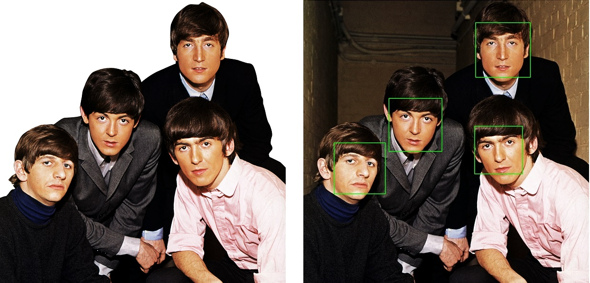
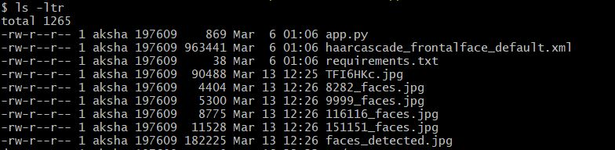
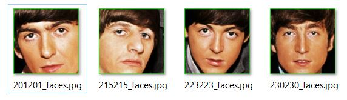

# How To - Detect and Extract faces from an Image using OpenCV and Python 

## Introduction

Facial recognition has now been around for some time. Nearly all the cool camera based gadgets that we see around us and use in everyday employ's some kind of facial recognition now. In case you want to write a custom app using facial recognition yourself, openCV is a wonderful library to get you started. OpenCV provides you with tools that enable you to write such an app fairly quick. In this tutorial we will see how using python and openCV, we can detect amd count number of faces appearing in an image. Next taking it a bit further, we will see how by writing some custom code around OpenCV, we can then extract the identified faces from the input image. 

Although we do this for faces but we should be able to extend our program for any random object in an input image. The only prerequisite here being that you have a OpenCV object detection model or an _HaaR Cascade_ trained for that object. In which case, we can easily train our own classifier for that custom object and then use it. 

For the sake of keeping the tutorial simple, we are going to use a publicly available OpenCV trained model for faces. OpenCV has graciously made available these trained cascade files for some of the most common objects used in image processing such as face, full body, eyes, etc . They can be found at openCV's [github repository](https://github.com/opencv/opencv/tree/master/data/haarcascades). We are gonna use one such model for faces.

Object detection and extraction in images becomes especially helpful in industries where automated cataloging is needed. Once quick example that comes to mind is automatically cataloging of library books from a picture of a book self. 

#### First thing first, what be OpenCV and a Haar Cascade

OpenCV or Open Source Computer Vision Library is an open source computer vision and machine learning library. Although most popular with python, it interfaces quite well with C++, Java and MATLAB. OpenCV is natively written in C++ and is widely used with computer vision related applications running on variety of systems like windows, linux, android , MacOS etc.

HAAR Cascade is an object detection algorithm used to locate an object of interest in images. Without getting into the technical details of its inner workings, Its an computer vision machine learning algorithm where a system is provided with a large number of positive and negative samples. Positive samples being the images with object of interest in them and negative samples with images having everything but the object. Finally methods exposed by openCV are used to train a model based on these positive and negative images. After the training the trained model( usually a xml file) can be then used to automatically locate the object in any new images.   

We have divided this tutorial in three parts. 

* Part One : Automatically detect faces in an input image.
* Part Two : Extracting all the faces found in previous step and saving them locally
* Part Three : Further reading and applications.

The idea here is to first write a script to detect faces in an input image in step 1. Next build on that script to add an extract and save method in step 2.

When we're finished, we should be able to pass an input image, having one or more person, to the script and see the script automatically  locating and extracting all faces found in that image to local drive. 

## Prerequisites

Before you begin this guide you'll need the following:

* A [local Python 3 development environment on windows 10](https://www.digitalocean.com/community/tutorials/how-to-install-python-3-and-set-up-a-local-programming-environment-on-windows-10), including [pip](https://pypi.org/project/pip/), a tool for installing Python packages, and [venv](https://docs.python.org/3/library/venv.html), for creating virtual environments.
* An python development IDE such as [Atom](https://atom.io/), [Pycharm](https://www.jetbrains.com/pycharm/download/) or Vim.
* Familiarity with basic concepts of image processing in general and openCV in particular.
* HaaR Cascade File for the object that wou want to extract. Pre trained cascades for common objects such as face, hand, eyes etc are available publicly on openCV's [github repository](https://github.com/opencv/opencv/tree/master/data/haarcascades). Please download the suitable xml file from there. In this example we are gonna use `haarcascade_frontalface_default.xml`.
 
## Step 1 — Writing an script to automatically detect faces in an input image

In this step we will create an script which would take an inmage as input, process it to detect any faces in it and finally create a bounding box around each face that it finds. Lets get stated !!

#### Setting up the workspace

Before we get started, we will need to create a workspace to hold all the code and install a few dependencies.

Create the directory by executing a `mkdir` in your workspace 

    mkdir face_scrapper

Next, Let's change into the newly created directory.

    cd face_scrapper

Activate the virtual env for this tutorial

    virtualenv face_scrapper
    source face_scrapper/Scripts/activate

Next we will create a requirements.txt file and install the dependencies needed by the project.

Create a `requirements.txt` file in your present directory using `touch`

    touch requirements.txt
    
Add following lines to newly created `requirements.txt` by opening it in yur favorite text editor.

    npmpy
    opencv-utils
    opencv-python

Now, we shall install dependencies using python package manager, `pip`

    pip install -r requirements.txt

Finally, download the [HAAR Cascade file](https://github.com/opencv/opencv/blob/master/data/haarcascades/haarcascade_frontalface_default.xml) for face detection from OpenCV github repository in your present directory. We shall use this file shortly in our code.

    wget https://github.com/opencv/opencv/blob/master/data/haarcascades/haarcascade_frontalface_default.xml

#### Code

In this section we shall look at the actual code that would take an input image and return two things :

* Number of faces found in the input image
* An output image with an rectangle plot around each of the face's found in the input image.

#### Code Walk through

We shall start by first importing libraries required by our program. Assumption behind this step is that the `pip install` we did in one of the previous step, ran without any issues 

    import cv2
    import sys

Next we shall read the input image and convert it to a grayscale. We do this using openCV's inbuilt read and convert functions.
The `cv2.imread` function takes the input image(passed as an argument to the script) and converts it to an openCV object. Next we use openCV's `cvtColor` function to convert the input color image object to an gray scale object. 

```python
...
# Read the image
image = cv2.imread(imagePath)
gray = cv2.cvtColor(image, cv2.COLOR_BGR2GRAY)
...
```
    
Here using the cascade file we downloaded earlier, we create a `cascadeClassifier` Model or in other words we load the HAAR cascade file using an openCV's `CascadeClassifier` method.

Next we apply openCV's `detectMultiScale` method on the face cascade loaded earlier. This generates a _list of rectangles_ for all the detected objects (in this case, faces) in the image. Doing a `len` on that list gives us the number of detection found. Will talk more about _list of rectangles_ in next section.

Lets take a min here to go through the parameters passed to `detectMultiScale` method in above example. 
* gray - This is the openCV's gray scale image object that we loaded earlier. 
* scaleFactor - Parameter specifying how much the image size is reduced at each image scale.
* minNeighbors - Parameter specifying how many neighbors each candidate rectangle should have to retain it. I have found tuning this parameter to be the most helpful in getting better detections. 
* minSize - Minimum possible object size. Objects smaller than that are ignored.

```python 
...
# detect faces in the image
faceCascade =  cv2.CascadeClassifier(cascPath)
faces = faceCascade.detectMultiScale(
        gray,
        scaleFactor=1.3,
        minNeighbors=3,
        minSize=(30, 30)
) 

print("Found {0} Faces !".format(len(faces)))
...
```
    
Finally, we simply plot _list of rectangles_ that we got earlier from `detectMultiScale` on the input image and save it to the disk as `faces_detected.jpg`.

```python    
...
# Draw a rectangle around the faces
for (x, y, w, h) in faces:
    cv2.rectangle(image, (x, y), (x+w, y+h), (0, 255, 0), 2)

status = cv2.imwrite('faces_detected.jpg', image)
print ("Image faces_detected.jpg written to file-system : ",status)
...
```


## Putting it all togather 

Listed below is the complete python code which uses the HaaR Cascade file, we downloaded in previous step, to detect faces in the input image. Save the below code in an `app.py` file.

```python
[label app.py]
import cv2
import sys

imagePath = sys.argv[1]
cascPath = "haarcascade_frontalface_default.xml"

# Read the image
image = cv2.imread(imagePath)
gray = cv2.cvtColor(image, cv2.COLOR_BGR2GRAY)

# detect faces in the image
faceCascade = cv2.CascadeClassifier(cascPath)
faces = faceCascade.detectMultiScale(
    gray,
    scaleFactor=1.3,
    minNeighbors=3,
    minSize=(30, 30)
)

print("[INFO] Found {0} Faces !".format(len(faces)))

# Draw a rectangle around the faces
for (x, y, w, h) in faces:
    cv2.rectangle(image, (x, y), (x + w, y + h), (0, 255, 0), 2)

status = cv2.imwrite('faces_detected.jpg', image)
print("[INFO] Image faces_detected.jpg written to file-system : ", status)
```

**The above code was sourced from OpenCV Documentation publicly available [here] (https://docs.opencv.org/3.4/db/d28/tutorial_cascade_classifier.html)**


#### Running the script

For this step we will have to find an image which you want to test your script with and save it in the same directory as your app.py. I choose an popular image of Beatles for this tutorial.

Next invoke the script as follow:


    python app.py path/to/input_image


<$>[note]
**Note:** Notice that the input image needs to be passed as an argument to the script.
<$>

Given here is an sample execution and output. If all looks good, you should be seeing a output similar to below at the time of the execution.

```
$ python app.py beatles-spotlight-514890404.png
[INFO] Found 4 Faces !
[INFO] Image faces_detected.jpg written to file-system :  True
```



Image on the left is the input image while the image on right is the output.

One curious thing that can be noticed is see how the background of the image changes from white to actual in the output image. This happened because most probably the original input had the background padded with white for better contrast and converting it to gray scale and back to color lost that additional padded information.  

## Step 2 — Extracting the faces found in previous steps and saving them locally as separate face shots.

In the last step we saw how using openCV and haar cascade for face, we were able to detect faces and draw an bounding box around them in a input image. In this section we are going to build on top of the script created in the last section and add the code to extract those faces from the input image.

Before moving forward, lets investigate this _list of rectangles_ that got returned from  `detectMultiScale` method in last step. This list actually is a list of `pixel locations`, in the form of `Rect(x,y,w,h)`, for all the objects that were detected in the input image based on the cascade provided. We then used those `pixel locations` to create a bounding box around all the detected faces in the image.

#### Code 

In this step we are simply going to build on the same logic and save each of the bounding box found in last step as a separate image. That's it. Lets see how to do it.

#### Code Walk through

As will be seen shortly, the script listed below is same as previous step for the most part except for a couple of lines. Lets look at those 

We only had to update the `for` loop we wrote earlier to as follows :

```python
...
for (x, y, w, h) in faces:
    cv2.rectangle(image, (x, y), (x + w, y + h), (0, 255, 0), 2)
    roi_color = image[y:y + h, x:x + w]
    print("[INFO] Object found. Saving to local !!")
    cv2.imwrite(str(w) + str(h) + '_faces.jpg', roi_color)
...
```

That's it. As can be seen we only added two additional lines to achieve this. Let's go through them one by one. 

    roi_color = image[y:y + h, x:x + w]

`roi_color` is the plot of `pixel locations` from list `faces` on the input color `image` for the first object.

    cv2.imwrite(str(w) + str(h) + '_faces.jpg', roi_color)
    
Next we simply save the plot as a new image using `cv2.imwrite` method. We append the width and height of the plot to the name of the image being written, just to keep the name unique.

#### Putting it all togather

Given here is the updated script. Please open the `app.py` we created earlier in your favorite IDE and replace its contents with code below.

```python
[label app.py]
import cv2
import sys

imagePath = sys.argv[1]
cascPath = "haarcascade_frontalface_default.xml"

# Read the image
image = cv2.imread(imagePath)
gray = cv2.cvtColor(image, cv2.COLOR_BGR2GRAY)

# detect faces in the image
faceCascade = cv2.CascadeClassifier(cascPath)
faces = faceCascade.detectMultiScale(
    gray,
    scaleFactor=1.3,
    minNeighbors=3,
    minSize=(30, 30)
)

print("[INFO] Found {0} Faces !".format(len(faces)))

# Draw a rectangle around the faces
for (x, y, w, h) in faces:
    cv2.rectangle(image, (x, y), (x + w, y + h), (0, 255, 0), 2)
    roi_color = image[y:y + h, x:x + w]
    print("[INFO] Object found. Saving to local !!")
    cv2.imwrite(str(w) + str(h) + '_faces.jpg', roi_color)

status = cv2.imwrite('faces_detected.jpg', image)
print("[INFO] Image faces_detected.jpg written to file-system : ", status)
```

**The above code was sourced from OpenCV Documentation publicly available [here] (https://docs.opencv.org/3.4/db/d28/tutorial_cascade_classifier.html) except for few changes**

The idea behind the code added is quite simple. We already had the pixel locations for all the detected objects in a list `faces`. We simply had to plot them on the input image and save those plots. Will look at it in more depth in following section.

#### Running the Updated Script

Running the script is same as before. Make sure the image you want to process is in the same folder as the script `app.py`. Next invoke the script as follows :

```
python app.py path/to/image
```

If all has been good so far, we should expect to see following output at the time of execution.

```
$ python app.py beatles-spotlight-514890404.png
[INFO] Found 4 Faces !
[INFO] Object found. Saving to local !!
[INFO] Object found. Saving to local !!
[INFO] Object found. Saving to local !!
[INFO] Object found. Saving to local !!
[INFO] Image faces_detected.jpg written to file-system :  True
```

Depending on how many faces were found in the input image, expect to see the line `[INFO] Object found. Saving to local !!` printed to the console that many times.

Looking at the contents of the working directory after the execution of the script, we should see head shots of all faces found in the input image.

 

#### Output

We should now see head shots extracted from the input image collected in the working directory 



That's it.

## Step 3 — Other Applications and Further Reading.

As can be seen, with a few lines of code, we were able to setup an automated application which can detect, count and extract faces from an image. A interested user can extend the application for may real world usage. Some that come to mind :

* Using a `full_body_haar_cascade.xml` available at openCV's github repository, once can write a similar app to count the number of pedestrians in an input image. 
* Any automated cataloging system would benefit from an application of similar nature. Please note that the user would in that case need to train their own Haar Cascade model for that object.
* Automated polling system from images where the object to be detected is automatically detected using a application of similar nature. The list goes on.


####  Further Reading and Citations

The code performing the object detection code was sourced from OpenCV Documentation publicly available [here](https://docs.opencv.org/3.4/db/d28/tutorial_cascade_classifier.html)

[OpenCV Standard Documentation](https://docs.opencv.org/3.0-beta/doc/tutorials/tutorials.html)

[learnopencv.com](https://learnopencv.com)

[Digital Image Processing](https://www.amazon.com/Digital-Image-Processing-Rafael-Gonzalez/dp/0133356728/ref=dp_ob_title_bk)


## Conclusion

Machine learning in general and Image Processing in particular are changing the world as we see today. From Medical to manufacturing, BFSI to engineering, pretty much all modern fields now employ some kind of Image processing.

The tutorial listed here barely begins to scratch the surface of possibilities of things that become possible with image processing. My humble hope is that this tutorial would ignite interest in a new user and act as an stepping stone for the experienced to take the next step in this field.

As always, Happy Coding !!
